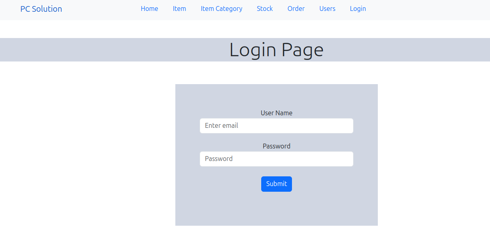
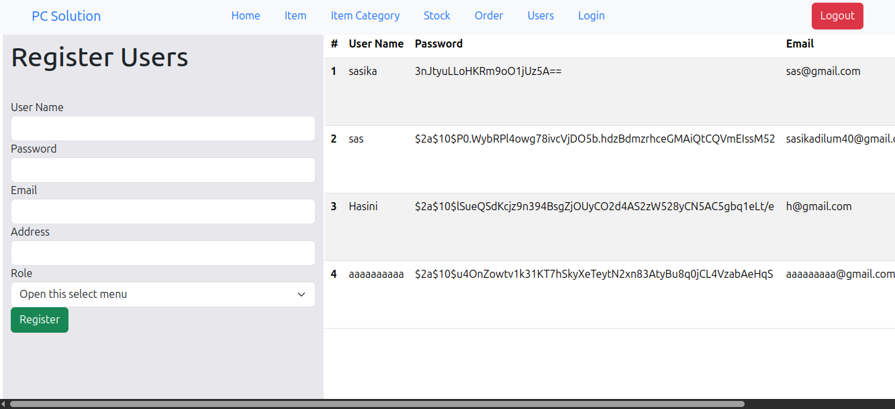
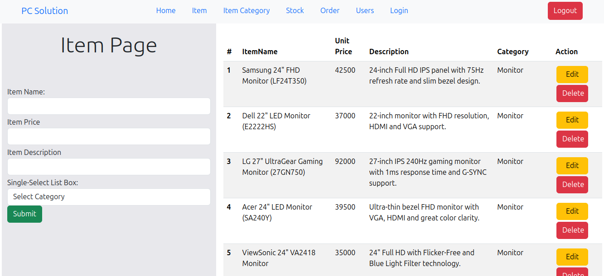
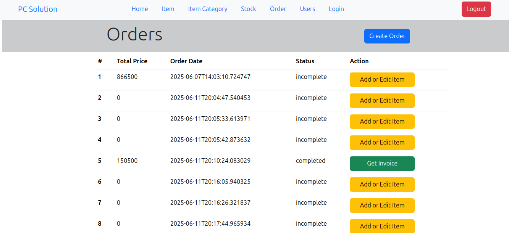
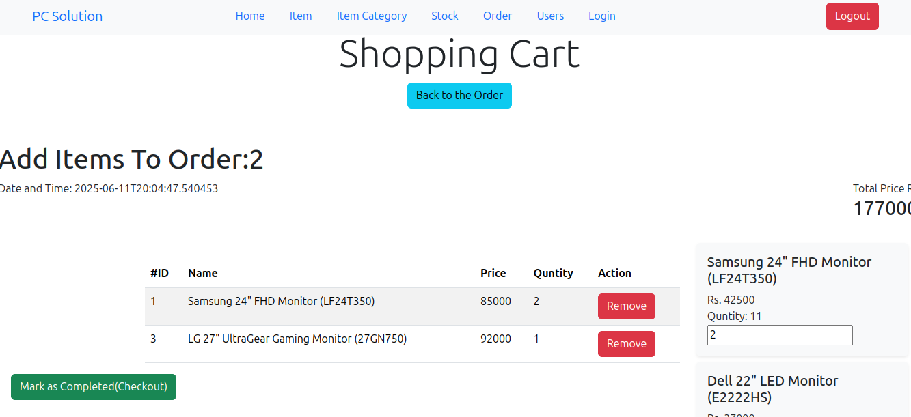
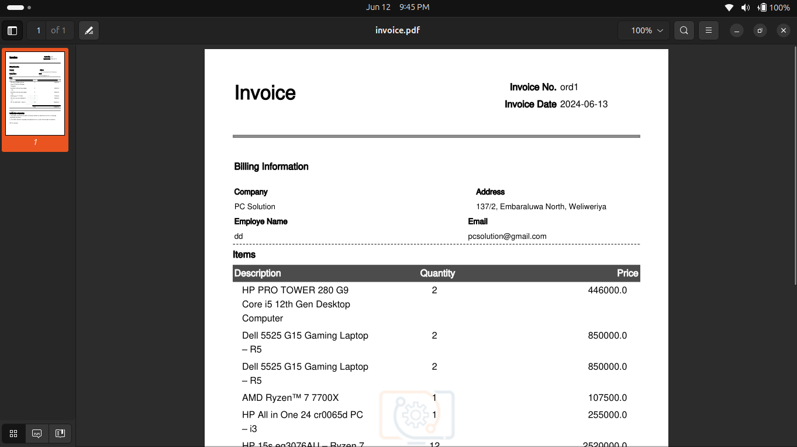
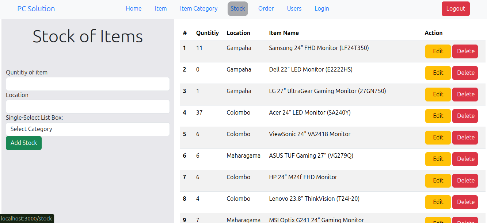
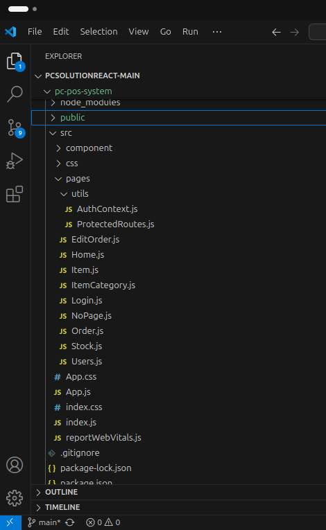

# 🖥️ PC Solution - Full Stack Web Application

A complete **full-stack application** for managing a PC/computer shop. Built using **React** for the frontend and **Spring Boot** for the backend.

> ⚠️ This app requires the backend to run first before launching the frontend.

---

## 🔗 Features

### 🔐 1. User Authentication
- Only authenticated users can access the system.
- Unauthorized users are redirected to the login page.

📸 

---

### 👤 2. Create Users
- Admin can create new user accounts.

📸 

---

### 📦 3. Category & Item Management
- Add, update, and delete categories.
- Add, update, and delete items under categories.

📸 

---

### 🛒 4. Order Creation (Authenticated Users)
- Authenticated users can create a new order.
- After creating an order, the system automatically redirects to the **Edit Order** page.

📸 

---

### ✏️ 5. Edit Existing Orders
- Orders can be edited from the orders list.
- Products can be added to or removed from an order.

📸 

---

### ✅ 6. Complete Order
- Orders can be marked as **complete**.
- Completed orders are removed from the active list.

📸 

---

### 📄 7. Invoice Generation
- A PDF invoice can be generated for any completed order.
- Invoice is downloaded and saved locally.

📸 

---

### 📄 8. Stock Update

📸 

---

## 🚀 Getting Started

## 🚀 How to Run the Project
### 📦 Backend (Spring Boot)


### 📦 Backend (Spring Boot)
1. Clone the backend project:
   ```bash
   git clone https://github.com/your-username/pcsolution-backend.git

2. **Open** the project in **IntelliJ IDEA** or **VS Code**.
3. **Run** the Spring Boot application.
4. The backend runs by default on:  
   👉 [http://localhost:8080](http://localhost:8080)

---

### 🌐 Frontend (React)

1. **Clone the frontend project:**

    ```bash
    git clone https://github.com/sasikad1/pcsolution-shop-react-frontend.git
    cd pcsolution-shop-react-frontend
    ```

2. **Install dependencies:**

    ```bash
    npm install
    ```

3. **Start the development server:**

    ```bash
    npm start
    ```

4. Visit the app in your browser:  
   👉 [http://localhost:3000](http://localhost:3000)

---

## 🔐 Authentication Logic

- All features are protected using **login-based authentication**.
- If a user is not authenticated, they will be automatically redirected to the **login page**.
- Only authenticated users can:
  - Create, update, and delete items/categories
  - Manage orders
  - Generate invoices

---

## 📁 Screenshots Folder

All screenshots should be stored in the `/screenshots` folder in the project root.

### Example folder structure:

📸 


---

## 👨‍💻 Developed By

**Sasika Dilum**  
📧 Email: [sasikadilum40@gmail.com](mailto:sasikadilum40@gmail.com)  
📍 Gampaha, Sri Lanka

